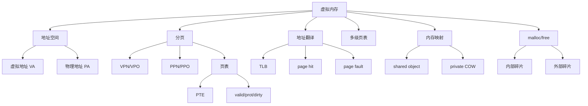

# 09 虚拟内存、mmap 与 malloc

## 本章知识图谱



## 为什么需要虚拟内存

虚拟内存提供三个核心能力：

- 简化内存管理：每个进程看到统一、连续的地址空间。
- 隔离和保护：不同进程同一虚拟地址可映射到不同物理页，权限可控。
- 高效共享：共享库、文件映射、copy-on-write。

虚拟地址空间：

$$
V=\{0,1,\dots,2^n-1\}
$$

物理地址空间：

$$
P=\{0,1,\dots,2^m-1\}
$$

## 分页

虚拟内存按页划分，物理内存按页帧划分。页大小为 $P=2^p$ 字节。

虚拟地址拆分：

```text
| VPN | VPO |
```

- VPN：Virtual Page Number。
- VPO：Virtual Page Offset，页内偏移，占 $p$ 位。

物理地址拆分：

```text
| PPN | PPO |
```

页内偏移不变：

$$
VPO=PPO
$$

## 页表与 PTE

页表是 PTE 数组，完成虚拟页到物理页的映射。

PTE 常含：

- valid bit：是否映射到物理内存。
- physical page number。
- 权限位：读、写、执行、用户/内核。
- dirty/reference 等状态位。

页命中：

- PTE valid。
- 权限允许。
- MMU 得到 PPN，拼接 offset 得到物理地址。

缺页：

- PTE invalid 或页面不在物理内存。
- CPU 触发 page fault。
- 内核缺页处理程序加载页面、更新 PTE。
- 可能回到 faulting instruction 重试。

## TLB

TLB 是页表项的 Cache，缓存 VPN 到 PPN 的翻译结果。

TLB hit：

- 不必访问内存中的页表。
- 直接得到 PPN。

TLB miss：

- 需要查页表。
- 查到 valid PTE 后填入 TLB。
- 若 PTE invalid，才可能 page fault。

高频区别：

- TLB miss 不等于 page fault。
- page fault 通常意味着所需虚拟页没有有效物理映射或权限异常。
- L1 Cache miss 也不等于 TLB miss，它们缓存的对象不同。

## 地址翻译模板

给定虚拟地址 VA：

1. 根据页大小求 $p=\log_2(\text{page size})$。
2. VPO = VA 低 $p$ 位。
3. VPN = VA 高位。
4. 用 VPN 查 TLB。
5. TLB miss 则查页表。
6. PTE valid 则 PPN + VPO 形成 PA。
7. PTE invalid 则 page fault。

## 多级页表

单级页表空间开销大。例：48 位虚拟地址，4KB 页，8B PTE：

$$
p=12,\quad VPN\ bits=48-12=36
$$

单级页表 PTE 数：

$$
2^{36}
$$

总大小：

$$
2^{36}\times 8 = 2^{39}B = 512GB
$$

多级页表只为实际使用的虚拟地址区域分配下级页表，节省空间。

## 多级页表计算模板

题：64 位 VA，页大小 8KB，PTE 8B，4 级页表。

页偏移：

$$
p=\log_2(8KB)=\log_2(8192)=13
$$

每页可放 PTE 数：

$$
\frac{8192}{8}=1024=2^{10}
$$

所以每级索引 10 位。

4 级页表支持 VPN 位数：

$$
4\times10=40
$$

最大有效虚拟地址位数：

$$
40+13=53
$$

注意：题目给“64 位虚拟地址空间”不代表所有 64 位都被当前 4 级结构实际覆盖。

## 逆向页表

逆向页表按物理页帧建表，而不是每个进程按虚拟页建表。

优势：

- 空间复杂度与物理内存大小成正比。
- 不与巨大虚拟地址空间直接成正比。

代价：

- 查找更复杂，通常依赖哈希和 TLB。
- 并不会消除 TLB miss。

## 内存映射

内存映射把虚拟内存区域和磁盘对象关联起来。

对象类型：

- 普通文件。
- 匿名对象。
- 共享对象。
- 私有 copy-on-write 对象。

`mmap`：

```c
void *mmap(void *start, size_t len, int prot, int flags, int fd, off_t offset);
```

常见用途：

- 把文件映射到内存，像访问数组一样访问文件内容。
- 共享库映射到多个进程。
- 父子进程 copy-on-write。

共享映射：

- 多个进程映射同一物理页。
- 修改可能对其他进程可见。

私有映射：

- 初始共享物理页。
- 写入时触发 copy-on-write，复制出私有页。

## Dirty COW 的课程意义

Dirty COW 展示 copy-on-write 与并发竞争的安全风险：

- 只读文件被私有映射。
- 一个线程反复写映射区域。
- 另一个线程反复 `madvise` 影响页面状态。
- 内核竞态导致写入突破预期权限。

复习重点不是攻击代码，而是理解：

- 内存映射。
- 私有 COW。
- 页权限。
- 并发竞态会破坏抽象。

## 动态内存分配

`malloc` 在堆上分配块，`free` 释放块。

```c
void *p = malloc(n);
free(p);
```

显式分配器：

- 程序显式调用 `malloc/free`。
- C/C++ 常见。

隐式分配器：

- 运行时自动回收。
- 例如垃圾回收语言。

## 块结构

分配器需要知道：

- 给定 payload 指针，块有多大？
- 块是否空闲？
- 空闲块如何组织？

常见做法是在 payload 前放 header：

```text
| header: size/allocated | payload ... | padding |
```

空闲块组织：

- 隐式空闲链表：遍历所有块。
- 显式空闲链表：只链接空闲块。
- 分离空闲链表：按大小类别维护多个链表。

## 碎片

内部碎片：已分配块内部浪费。

来源：

- 对齐要求。
- header/footer 元数据。
- 分配器给出的块比请求大。

外部碎片：空闲总量足够，但没有单个连续空闲块足够大。

高频判断：

- “合计空闲空间足够但没有单独大块”是外部碎片。
- “payload 小于块大小造成浪费”是内部碎片。

## 内存泄漏

内存泄漏：程序丢失已分配堆块的指针，无法再释放。

例：

```c
void f(void) {
    char *p = malloc(100);
    if (!p) return;
    p = malloc(200);  /* 原来的 100 字节地址丢失 */
    free(p);
}
```

正确做法：

```c
char *p = malloc(100);
...
free(p);
p = NULL;
```

## 本章高频错因

- 把虚拟地址空间大小和物理内存大小混为一谈。
- 认为同一虚拟地址在不同进程必定映射到同一物理地址。
- 认为内核代码在用户态可随意访问。用户态不能执行特权访问。
- 把 TLB miss 当作 page fault。
- 页表大小计算忘记 PTE 大小。
- 多级页表题忘记每级页表也要装进一个页。
- `malloc` 不一定立即触发物理页分配，可能首次访问时才缺页分配。
- `free` 后继续使用指针是 use-after-free，不是普通内存泄漏。

