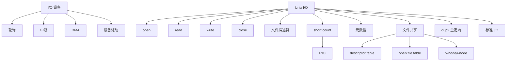

# 10 系统级 I/O

## 本章知识图谱



## I/O 设备交互方式

轮询：

- CPU 不断检查设备状态。
- 实现简单。
- 浪费 CPU。

中断：

- 设备完成或需要服务时中断 CPU。
- CPU 不必一直等待。
- 每次中断仍有上下文切换和处理开销。

DMA：

- Direct Memory Access。
- CPU 初始化传输后，DMA 控制器直接在设备和内存间搬运数据。
- 传输过程中 CPU 不逐字节参与。
- 大块数据传输效率高。

高频判断：

- DMA 不是完全不需要 CPU，初始化和完成处理仍需 CPU。
- DMA 优势是减少数据传输过程中的 CPU 参与。

## Unix 文件抽象

Linux 文件是字节序列：

$$
B_0,B_1,\dots,B_{m-1}
$$

一切皆文件：

- 普通文件。
- 目录。
- 设备。
- 管道。
- socket。

统一接口：

```c
int open(const char *filename, int flags, mode_t mode);
ssize_t read(int fd, void *buf, size_t n);
ssize_t write(int fd, const void *buf, size_t n);
int close(int fd);
```

文件描述符是进程中的小整数：

- 0：stdin。
- 1：stdout。
- 2：stderr。

## 文件类型

普通文件：

- 文本文件是只包含文本编码的普通文件。
- 二进制文件是任意字节序列。
- 内核不区分文本/二进制，应用程序解释内容。

目录：

- 文件名到文件的映射。
- 目录本身也是文件。

## open/read/write/close

`open` 返回 fd，并在内核中建立打开文件状态。

`read`：

- 从当前文件位置复制字节到用户缓冲区。
- 更新文件位置。
- 返回实际读到的字节数。

`write`：

- 从用户缓冲区复制字节到当前文件位置。
- 更新文件位置。
- 返回实际写入的字节数。

`close`：

- 释放 fd。
- 可能返回错误，例如延迟写回失败，因此也应检查返回值。

## Short Count

short count 指 `read/write` 返回值小于请求字节数。

可能原因：

- 读到 EOF。
- 从终端读取一行。
- socket 或 pipe 当前只有部分数据。
- 写入时内核缓冲区暂时容纳不了全部数据。

普通磁盘文件读写较少出现 short count，但网络程序必须处理。

## RIO

RIO：Robust I/O，封装 Unix I/O，处理 short count。

无缓冲函数：

- `rio_readn`：尽量读满 n 字节，除非 EOF 或错误。
- `rio_writen`：尽量写满 n 字节。

带缓冲函数：

- `rio_readlineb`：读一行。
- `rio_readnb`：读 n 字节。

网络程序常用 RIO，因为 socket I/O 很容易 short count。

## 文件元数据

元数据包括：

- 文件类型。
- 大小。
- 权限。
- 所有者。
- 时间戳。
- 块位置等。

`stat`/`fstat` 可读取文件元数据。

权限码：

```text
rwxr-x--x
```

分三组：

- user：`rwx` = 7。
- group：`r-x` = 5。
- other：`--x` = 1。

所以八进制权限是 `751`。

## 打开文件的内核表示

三层结构：

1. Descriptor table：每个进程一张，fd 指向 open file table entry。
2. Open file table：系统范围，保存文件位置、引用计数、打开模式。
3. v-node/i-node table：文件元数据。

`fork` 后：

- 子进程复制父进程 descriptor table。
- 父子 fd 指向同一 open file table entry。
- 因此共享文件位置。

`execve` 后：

- 默认保留打开文件描述符。
- 可用 close-on-exec 控制。

## I/O 重定向

Shell 中：

```bash
ls > foo.txt
```

子进程在 `execve` 前做：

```c
int fd = open("foo.txt", O_WRONLY | O_CREAT | O_TRUNC, 0644);
dup2(fd, STDOUT_FILENO);
close(fd);
execve("/bin/ls", argv, envp);
```

`dup2(oldfd, newfd)` 让 `newfd` 指向 `oldfd` 指向的打开文件。

## 标准 I/O

标准 I/O 如：

```c
printf, scanf, fgets, fputs, fread, fwrite
```

它们基于 `FILE *` stream，内部有用户级缓冲区。

缓冲类型：

- 全缓冲：文件常见。
- 行缓冲：终端常见，遇 `\n` 刷新。
- 无缓冲：stderr 常见。

选择原则：

- 普通文件处理可用标准 I/O。
- 网络 socket 推荐 RIO 或直接 Unix I/O。
- 不要在同一个 fd 上混用标准 I/O 和 Unix I/O，缓冲状态容易错乱。

## 本章高频错因

- 把 fd 当成全系统唯一。fd 只在进程内有意义。
- 认为 `read` 请求多少一定返回多少。
- 忘记 `write` 也可能 short count。
- 不理解 `fork` 后父子共享打开文件位置。
- `dup2` 的参数顺序写反。
- 在信号 handler 中使用标准 I/O。
- 网络程序用 `read` 一次就假设收完完整应用消息。

