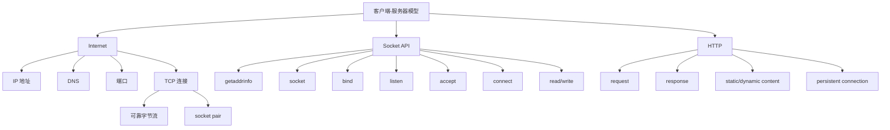

# 11 网络编程

## 本章知识图谱



## 客户端-服务器模型

服务器：

- 长期运行。
- 监听固定端口。
- 等待客户端连接。
- 为请求提供服务。

客户端：

- 主动发起连接。
- 向服务器发送请求。
- 接收响应。

一个 TCP 连接由 socket pair 唯一确定：

```text
(client IP, client port, server IP, server port)
```

## 网络层次概念

网络由局域网、路由器、广域网、协议软件共同组成。

IP 提供跨网络主机寻址和分组传输。TCP 基于 IP，提供可靠、有序、面向连接的字节流。

程序员眼中的 Internet：

- 主机由 IP 地址标识。
- 服务由端口标识。
- 域名通过 DNS 映射到 IP。
- 进程通过 socket 通信。

## IP、端口与 DNS

IPv4 地址常用点分十进制显示，例如 `127.0.0.1`。

`struct in_addr` 保存网络字节序 IP 地址。

端口是 16 位整数：

- 0-1023：知名端口，通常需要权限。
- HTTP 默认 80。
- HTTPS 默认 443。

DNS 把域名解析为 IP 地址。程序中推荐使用 `getaddrinfo`，而不是旧式 `gethostbyname`。

## TCP 的性质

TCP 提供：

- 面向连接。
- 可靠传输。
- 有序字节流。
- 拥塞控制和流量控制。

重要陷阱：

- TCP 是字节流，不保留应用层消息边界。
- 一次 `write` 对方可能多次 `read` 才读完。
- 多次 `write` 对方也可能一次 `read` 读到。
- 应用层必须自己定义消息边界，例如长度字段、分隔符、HTTP Content-Length。

## TCP 三次握手

过程：

1. 客户端发送 SYN。
2. 服务器回复 SYN+ACK。
3. 客户端回复 ACK。

为什么不是两次：

- 双方都要确认自己的发送能力和接收能力。
- 防止旧的重复 SYN 造成半开或错误连接。
- 第三次 ACK 让服务器确认客户端收到了自己的 SYN+ACK。

## Socket API：服务器端

典型服务器流程：

```c
int listenfd = socket(AF_INET, SOCK_STREAM, 0);
bind(listenfd, (struct sockaddr *)&addr, sizeof(addr));
listen(listenfd, LISTENQ);
while (1) {
    int connfd = accept(listenfd, (struct sockaddr *)&client, &len);
    handle(connfd);
    close(connfd);
}
```

各函数：

- `socket`：创建套接字描述符。
- `bind`：绑定本地 IP/端口。
- `listen`：把主动套接字转为监听套接字，准备接受连接。
- `accept`：阻塞等待客户端连接，返回已连接描述符。

高频填空：服务器 `bind()` 后调用 `listen()` 进入被动监听状态。

## Socket API：客户端

典型客户端流程：

```c
int clientfd = socket(AF_INET, SOCK_STREAM, 0);
connect(clientfd, (struct sockaddr *)&server, sizeof(server));
write(clientfd, request, strlen(request));
read(clientfd, buf, sizeof(buf));
close(clientfd);
```

`connect` 主动向服务器发起 TCP 连接。

## 监听描述符与已连接描述符

监听描述符 `listenfd`：

- 只用于接受连接请求。
- 生命周期通常贯穿服务器运行。

已连接描述符 `connfd`：

- 对应某个具体客户端连接。
- 用于和该客户端读写。
- 服务完成后关闭。

不要在处理一个客户端后关闭 `listenfd`。

## 简单 TCP 服务器片段

```c
#include <arpa/inet.h>
#include <netinet/in.h>
#include <string.h>
#include <sys/socket.h>
#include <unistd.h>

int main(void) {
    int listenfd = socket(AF_INET, SOCK_STREAM, 0);

    struct sockaddr_in addr;
    memset(&addr, 0, sizeof(addr));
    addr.sin_family = AF_INET;
    addr.sin_addr.s_addr = htonl(INADDR_ANY);
    addr.sin_port = htons(8080);

    bind(listenfd, (struct sockaddr *)&addr, sizeof(addr));
    listen(listenfd, 16);

    while (1) {
        int connfd = accept(listenfd, NULL, NULL);
        const char msg[] = "Hello, World!";
        write(connfd, msg, sizeof(msg) - 1);
        close(connfd);
    }
}
```

真实代码必须检查每个系统调用返回值，并处理端口复用、并发、short count。

## HTTP 基础

HTTP 请求：

```text
GET /index.html HTTP/1.1
Host: example.com

```

请求 = 请求行 + 0 个或多个请求头 + 空行 + 可选 body。

响应：

```text
HTTP/1.1 200 OK
Content-Length: 13
Content-Type: text/plain

Hello, World!
```

响应 = 状态行 + 响应头 + 空行 + body。

## 静态内容与动态内容

静态内容：

- 服务器读取磁盘文件。
- 返回文件内容。

动态内容：

- 服务器执行程序生成响应。
- 参数可来自 URI query string、请求 body、header。
- CGI 风格中，服务器通过环境变量和标准输入传参，通过 stdout 接收子进程输出。

## HTTP/1.0 非持久连接 vs HTTP/1.1 持久连接

HTTP/1.0 非持久连接：

- 通常一个请求/响应使用一个 TCP 连接。
- 响应后关闭连接。
- 多个对象需要多次建立连接。

HTTP/1.1 持久连接：

- 默认复用同一 TCP 连接处理多个请求/响应。
- 减少握手和慢启动开销。
- 需要明确消息边界，例如 `Content-Length` 或 chunked encoding。

对代理服务器影响：

- 必须正确解析请求和响应边界。
- 不能简单以连接关闭作为响应结束。
- 需要管理连接复用、超时、并发和头部转发。

## NAT 扩展考点

NAT 允许私有 IP 主机访问公网：

- 修改源 IP/端口。
- 维护内部连接到外部连接的映射表。
- 隐藏内部网络结构。

问题：

- 影响端到端连接。
- 某些协议把 IP/端口写在 payload 中，NAT 难以处理。
- IPsec 等协议可能受影响。

## 本章高频错因

- 认为 TCP 保留消息边界。
- 把 `bind` 和 `connect` 混淆。
- 服务器 `bind` 后忘记 `listen`。
- `accept` 返回的是新连接 fd，不是原来的 `listenfd`。
- HTTP 持久连接下用连接关闭判断 body 结束。
- 忽略网络字节序，端口/IP 需要 `htons/htonl`。

