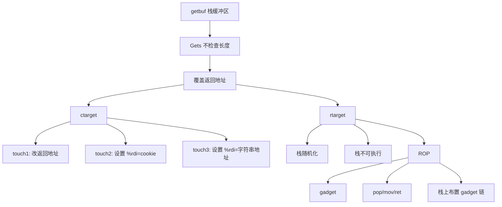

# 12 Attack Lab：栈溢出、代码注入与 ROP

## 本章知识图谱



## 实验目标

Attack Lab 用两个程序理解缓冲区溢出：

- `ctarget`：栈位置稳定，栈可执行，适合代码注入。
- `rtarget`：栈随机化且不可执行，适合 ROP。

核心学习目标：

- 理解 x86-64 栈和参数传递。
- 理解返回地址如何被 `ret` 使用。
- 理解机器指令字节编码。
- 理解现代系统用 ASLR、NX 等机制阻止代码注入。

## 漏洞函数

典型漏洞：

```c
unsigned getbuf() {
    char buf[BUFFER_SIZE];
    Gets(buf);
    return 1;
}
```

`Gets` 不知道 `buf` 大小，输入过长会覆盖：

```text
低地址
buf[0]
...
buf[BUFFER_SIZE-1]
saved registers / padding
return address
高地址
```

当 `getbuf` 执行 `ret`：

1. 从 `%rsp` 指向位置取 8 字节。
2. 把该值写入 `%rip`。
3. CPU 跳转到新地址。

若返回地址被输入覆盖，控制流就被劫持。

## 小端序与地址书写

地址 `0x4017ec` 在 payload 中写成 8 字节小端：

```text
ec 17 40 00 00 00 00 00
```

原则：最低有效字节放在最低地址。

Attack Lab 输入用 `hex2raw` 把十六进制文本变成原始字节。

注意：

- 中间不能出现 `0x0a`，因为它是换行，会终止 `Gets`。
- 每个字节写两位十六进制，例如 `00`。
- 可以用注释分段标记 payload。

## Phase 1：跳到 `touch1`

不注入代码，只覆盖返回地址为 `touch1` 地址。

payload 结构：

```text
[填充到返回地址]
[touch1 地址，小端]
```

关键是确定：

- `buf` 到返回地址的偏移。
- `touch1` 起始地址。

工具：

```bash
objdump -d ctarget
gdb ctarget
```

## Phase 2：调用 `touch2(cookie)`

`touch2` 需要第一个参数在 `%rdi`。目标是让：

```text
%rdi = cookie
%rip = touch2
```

代码注入思路：

1. 把一小段机器码放入输入字符串中。
2. 覆盖返回地址为注入代码地址。
3. 注入代码设置 `%rdi`。
4. 用 `ret` 跳到 `touch2`。

示意汇编：

```asm
movq $cookie, %rdi
pushq $touch2
ret
```

也可把 `touch2` 地址放在栈上，然后注入代码最后 `ret`。

为什么推荐 `ret` 而不是 `jmp/call`：

- `jmp/call` 编码常用相对位移，手工构造更麻烦。
- `ret` 只依赖栈上的绝对地址。

## Phase 3：调用 `touch3(cookie_string)`

`touch3` 需要参数是字符串地址：

```c
touch3(char *sval)
```

字符串内容是 cookie 的 8 个十六进制字符，不带 `0x`，末尾 `\0`。

关键风险：

- `hexmatch` 和 `strncmp` 会继续使用栈，可能覆盖 `getbuf` 原栈区域。
- cookie 字符串要放在不会被后续调用覆盖的位置。

payload 需要：

```text
[注入代码]
[填充]
[返回地址 -> 注入代码]
[touch3 地址或后续 ret 地址]
[cookie 字符串 + 00]
```

注入代码设置：

```asm
movq $cookie_string_addr, %rdi
ret
```

## ROP 背景

`rtarget` 阻止代码注入：

- 栈随机化：不知道注入代码运行时地址。
- 栈不可执行：即使跳到栈上也会段错误。

ROP 不注入新指令，而是复用程序中已有指令片段。

gadget：

```text
[一小段有用指令] ret
```

把栈布置成：

```text
gadget1_addr
data_for_pop
gadget2_addr
gadget3_addr
...
target_func_addr
```

每个 gadget 结束的 `ret` 会跳到栈上的下一个地址。

## Gadget 来源

`farm.c` 中有很多类似函数：

```c
unsigned addval_152(unsigned x) {
    return x + 2428995912U;
}
```

编译后机器码中可能包含某些字节序列，例如：

```asm
48 89 c7 c3
```

可解释为：

```asm
movq %rax, %rdi
ret
```

即使这个序列位于某条原始指令的中间，x86-64 是变长指令集，也可以从中间地址开始执行形成 gadget。

规则：

- 只使用 `start_farm` 到 `end_farm` 范围内的 gadget。
- Phase 4 通常只需要 `popq` 和 `movq` 等少数 gadget。

## Phase 4：ROP 调用 `touch2(cookie)`

目标仍是：

```text
%rdi = cookie
%rip = touch2
```

典型 gadget 链：

```text
popq %rax; ret
cookie
movq %rax, %rdi; ret
touch2
```

栈执行过程：

1. 第一个 `ret` 跳到 `popq %rax; ret`。
2. `popq %rax` 从栈取 cookie。
3. `ret` 跳到 `movq %rax,%rdi; ret`。
4. 设置参数。
5. `ret` 跳到 `touch2`。

## Phase 5：ROP 调用 `touch3(cookie_string)`

难点：

- 要传字符串地址。
- 栈地址随机化，不能写死绝对栈地址。
- 需要用 gadget 计算相对 `%rsp` 的地址。

官方提示中需要更多 gadget，包括 `movl` 和 functional nop。复习重点：

- 32 位 `movl` 写寄存器会清高 32 位。
- 可用 `%rsp` 当前值加偏移得到字符串地址。
- ROP 链既包含 gadget 地址，也包含立即数和字符串数据。

## 生成机器码

写 `.s`：

```asm
movq $0x59b997fa, %rdi
ret
```

编译反汇编：

```bash
gcc -c exploit.s
objdump -d exploit.o
```

取字节序列，交给 `hex2raw`。

## 防御机制

| 防御 | 作用 | 能否完全解决 |
|:---:|:---:|:---:|
| 栈 canary | 检测返回地址附近被破坏 | 可被泄露或绕过 |
| NX/W^X | 栈不可执行，阻止代码注入 | ROP 可复用已有代码 |
| ASLR | 地址随机化 | 信息泄露可绕过 |
| PIE | 程序代码地址随机化 | 需要配合 ASLR |
| RELRO | 保护 GOT 等表 | 不能阻止所有控制流攻击 |

## 本章高频错因

- 忘记第一个参数在 `%rdi`。
- 地址没有按小端序写。
- payload 中间出现 `0x0a`。
- 覆盖返回地址偏移算错。
- 在 `rtarget` 中仍试图执行栈上注入代码。
- gadget 地址没有限制在 farm 范围。
- 不理解 `popq` 会消耗栈上的下一个 8 字节。
- Phase 3/5 把字符串放在会被后续函数调用覆盖的位置。

